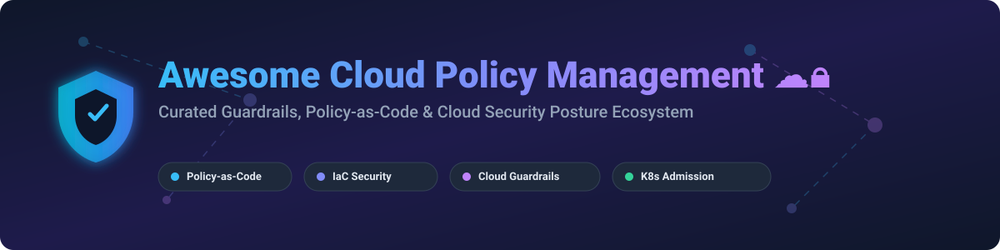

  

# ☁️🔒 Awesome Cloud Policy Management

  
  
  
  
  

> **A curated list of Cloud Policy Management SaaS platforms, Policy-as-Code engines, Cloud Guardrails, IaC Security, and Runtime Enforcement frameworks.** 🛡️⚡

---

## 📑 Table of Contents

- [🌐 SaaS / Hosted Platforms](#-saas--hosted-platforms)
- [🔓 Open-Source GitHub Projects](#-open-source-github-projects)
  - [🛡️ Cloud Account Governance](#️-cloud-account-governance)
  - [☸️ Kubernetes Admission Control & Posture](#️-kubernetes-admission-control--posture)
  - [🏗️ IaC & Configuration Policy Scanning](#️-iac--configuration-policy-scanning)
  - [📊 Cloud Asset Inventory & CSPM](#-cloud-asset-inventory--cspm)
- [📈 Star History](#-star-history)
- [💖 Support & Contributing](#-support--contributing)
- [⚖️ Disclaimer](#️-disclaimer)

---

## 🌐 SaaS / Hosted Platforms

> 📊 **Market Overview & Size**: The global Cloud Security Posture Management (CSPM) and Policy-as-Code market size is estimated at **$5.8 Billion (2026)** and is projected to surpass **$12.4 Billion by 2030**, growing at a CAGR of ~21%.
> 
> 🧩 **Market Structure**: The sector is **moderately fragmented**, bridging hyper-scaler native services (Microsoft, AWS, GCP), enterprise cybersecurity behemoths (Palo Alto Networks, IBM), and specialized venture-backed platforms (Snyk, Stacklet, Styra).

| Platform | Description & Key Features | Pricing Tier | Free Tier / Trial Limits | Company Size (Market Cap / Valuation / ARR) |
| :--- | :--- | :--- | :--- | :--- |
| **[Microsoft Azure Policy](https://azure.microsoft.com/en-us/products/azure-policy)** 🔷 | Native Azure policy engine enforcing audit, deny, and remediation at resource provider level. | **$0 / month** (Included with Azure) | **Always Free** for native Azure resources. 30-Day Free Trial ($200 credits). | **$3.80 Trillion** *(Public Market Cap: MSFT)* |
| **[Palo Alto Prisma Cloud](https://www.paloaltonetworks.com/prisma/cloud)** 🛡️ | Enterprise CNAPP platform with multi-cloud policy enforcement and IaC security. | **$90 / credit / year** (Starting tier) | **30-Day Free Trial** with full sandbox capabilities. | **$285.00 Billion** *(Public Market Cap: PANW)* |
| **[HashiCorp Sentinel](https://www.hashicorp.com/sentinel)** 🏗️ | Embedded policy-as-code gatekeeper for HCP Terraform and Terraform Enterprise. | **$0.10 / RUM / month** (Essentials starting tier) | **500 Managed Resources Free forever** (Single concurrent run limit). | **$7.00 Billion** *(Acquired by IBM / Prev Market Cap)* |
| **[Snyk IaC](https://snyk.io/product/infrastructure-as-code-security/)** 🐶 | Developer-first IaC misconfiguration scanner for Terraform, K8s, ARM, and CloudFormation. | **$25 / dev / month** (Team tier) | **Free Forever** (Limit: 300 IaC scans/mo & 400 Open Source scans/mo). | **$7.40 Billion** *(Valuation / ~$300M ARR)* |
| **[Stacklet](https://stacklet.ai/)** ⚡ | Commercial cloud governance platform built by core creators of Cloud Custodian. | **$12,000 / year** (Starting commercial tier) | **14-Day Free Trial** available via AWS Marketplace / Sales. | **$75.00 Million** *(Estimated Valuation / $36.5M Raised)* |
| **[Styra DAS](https://www.styra.com/)** 📜 | Declarative authorization control plane built on Open Policy Agent (OPA). | **$250 / month** (Historical Team tier) | **Free Edition** (up to 3 clusters / 10 systems). *(Product Sunset 2025)* | **$67.50 Million** *(Total VC Funding Raised)* |

---

## 🔓 Open-Source GitHub Projects

The open-source ecosystem for Cloud Policy Management is mature, production-ready, and widely adopted across enterprise platform teams.

---

### 🛡️ Cloud Account Governance

- **[Cloud Custodian](https://github.com/cloud-custodian/cloud-custodian)**   
  *CNCF Incubating YAML-based stateless engine for real-time cloud governance, compliance, and cost optimization across AWS, Azure, and GCP.*

---

### ☸️ Kubernetes Admission Control & Posture

- **[Open Policy Agent (OPA)](https://github.com/open-policy-agent/opa)**   
  *CNCF Graduated general-purpose policy engine using Rego for unified policy enforcement across Kubernetes, microservices, and CI/CD.*
- **[Infracost](https://github.com/infracost/infracost)**   
  *Cloud cost policies and shift-left cost guardrails for Terraform in pull requests.*
- **[Kubescape](https://github.com/kubescape/kubescape)**   
  *CNCF K8s security posture & runtime threat detection platform powered by CEL and eBPF.*
- **[Kyverno](https://github.com/kyverno/kyverno)**   
  *CNCF Graduated Kubernetes-native policy engine using YAML DSL and CEL rules for validation, mutation, and generation.*
- **[OPA Gatekeeper](https://github.com/open-policy-agent/gatekeeper)**   
  *Customizable admission control webhook for Kubernetes integrating OPA and CRDs.*
- **[Kubewarden](https://github.com/kubewarden/adm-controller)**   
  *CNCF WebAssembly (WASM) powered admission controller allowing policy authoring in Rust, Go, or Rego.*

---

### 🏗️ IaC & Configuration Policy Scanning

- **[Trivy](https://github.com/aquasecurity/trivy)**   
  *Comprehensive security scanner for container images, IaC misconfigurations, secrets, and SBOMs.*
- **[Checkov](https://github.com/bridgecrewio/checkov)**   
  *Static code analysis tool for Infrastructure-as-Code (Terraform, CloudFormation, K8s, ARM, Helm) with 750+ built-in policies.*
- **[Terrascan](https://github.com/tenable/terrascan)**   
  *Static code analyzer for Infrastructure as Code with 500+ out-of-the-box policies written in OPA/Rego.*
- **[Oso](https://github.com/osohq/oso)**   
  *Open-source authorization engine and declarative policy language (Polar) for application security.*
- **[Starlark](https://github.com/google/starlark-go)**   
  *Python-like deterministic configuration and policy execution language created by Google.*
- **[KICS](https://github.com/Checkmarx/kics)**   
  *Keeping Infrastructure as Code Secure - static analysis for IaC templates with thousands of queries.*
- **[Conftest](https://github.com/open-policy-agent/conftest)**   
  *Utility for running Rego policies against arbitrary configuration files (YAML, JSON, HCL, TOML).*
- **[Pulumi Policy (CrossGuard)](https://github.com/pulumi/pulumi-policy)**   
  *Policy-as-code framework for Pulumi enabling guardrails in TypeScript, Python, and Rego.*

---

### 📊 Cloud Asset Inventory & CSPM

- **[Prowler](https://github.com/prowler-cloud/prowler)**   
  *Multi-cloud security assessment tool for AWS, Azure, GCP, and Kubernetes aligned with CIS benchmarks.*
- **[CloudQuery](https://github.com/cloudquery/cloudquery)**   
  *Open-source high-performance data integration framework for cloud assets into SQL databases for policy reporting.*
- **[StackRox](https://github.com/stackrox/stackrox)**   
  *Kubernetes-native security platform for policy enforcement, vulnerability management, and threat detection.*

---

## 📈 Star History

---

## 💖 Support & Contributing

Contributions are warmly welcome! If you'd like to add a new open-source policy tool or SaaS platform, feel free to open a Pull Request.

- ⭐ **Star this repository** to show your support and help others discover it!
- 🍴 **Fork the repo** to contribute new tools and guardrail frameworks.
- 📢 **Share with your team** and cloud security colleagues.
- ☕ **Sponsor the Maintainer**: If you find this list helpful, consider supporting via the [GitHub Sponsor Dashboard](https://github.com/sponsors/ishandutta2007).

---

## ⚖️ Disclaimer

- This list is **community-curated** for educational and research purposes.
- Product names, logos, and brands belong to their respective owners.
